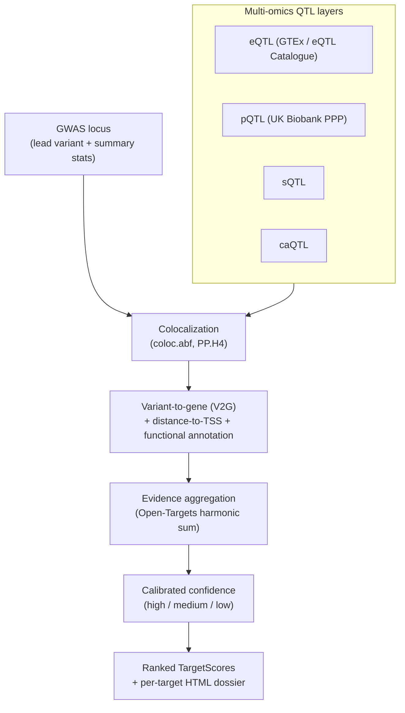

# omics-target-prioritization

[](https://github.com/abayatibrain/omics-target-prioritization/actions/workflows/ci.yml)
[](https://www.python.org/downloads/)
[](LICENSE)
[](https://github.com/astral-sh/ruff)
[](https://mypy-lang.org/)

Integrate GWAS signals with multi-omics QTLs (eQTL / pQTL / sQTL / caQTL) via
**colocalization-based variant-to-gene mapping**, then aggregate the evidence
into a **calibrated, provenance-tracked target-prioritization score** and a
per-target dossier.

## What biological question this answers

A genome-wide association study (GWAS) tells you *where* on the genome a
disease signal lives — usually a block of correlated common variants spanning
several genes. It does **not** tell you *which gene* in that block is the one
the variant actually acts through, and therefore which protein a drug should
target. The nearest gene to the lead variant is wrong roughly half the time.

This repository answers a sharper question:

> **Given a disease GWAS locus, which gene is the variant most plausibly acting
> through, and how confident should we be — backed by what evidence?**

It does so the way modern statistical-genetics target-ID pipelines do: by
asking whether the **same causal variant** that drives the disease signal also
drives a molecular-trait signal (a QTL) for a specific gene. If the GWAS signal
and a gene's expression QTL (eQTL), protein QTL (pQTL), splicing QTL (sQTL), or
chromatin-accessibility QTL (caQTL) **colocalize** — i.e. share one underlying
causal variant rather than two distinct variants in linkage — that gene gets
credit. Multiple corroborating molecular layers raise confidence; a gene that
is merely *close* but never colocalizes does not. The layers of evidence are
then combined with an Open-Targets-style harmonic-sum into a single calibrated
score in `[0, 1]`, and every contribution carries its provenance (dataset,
method, timestamp) so a reviewer can audit *why* a target ranked where it did.

## Pipeline



## Quick start

```bash
# Install (editable, with dev tooling)
pip install -e .

# End-to-end demo on a simulated locus: simulate -> integrate -> score -> report
omics-target-prioritization run-all --out results/

# Or step by step
omics-target-prioritization simulate  --out results/locus.json
omics-target-prioritization integrate --locus results/locus.json --out results/evidence.json
omics-target-prioritization score     --evidence results/evidence.json --out results/scores.json
omics-target-prioritization report    --scores results/scores.json --out results/dossier.html
```

## Method, in one paragraph

For each candidate gene at a locus we run a per-SNP **approximate Bayes factor
colocalization** (Giambartolomei et al. 2014, `coloc.abf`) between the GWAS
summary statistics and each available QTL dataset for that gene, recovering the
posterior `PP.H4` that the two traits share a single causal variant. `PP.H4` per
QTL layer/tissue, a **distance-to-TSS exponential decay** feature, and an
optional **functional-annotation** feature each become a provenance-stamped
`EvidenceItem`. Per-source evidence is combined with the **Open Targets
harmonic-sum** (scores sorted descending, `Σ score_i / (i+1)²`, normalized by
the theoretical maximum) into an overall score in `[0, 1]`. A calibrated rule
maps the number of independent corroborating layers, the maximum `PP.H4`, and
the score to a high/medium/low confidence label. See
[`docs/methods.md`](docs/methods.md) and the ADRs in
[`docs/adrs/`](docs/adrs/).

## Repository layout

```
src/omics_target_prioritization/
├── models.py              # pydantic evidence-chain models
├── simulate.py            # GWAS + multi-omics QTL simulator (SimConfig)
├── coloc.py               # Giambartolomei-2014 coloc.abf
├── integrate/v2g.py       # colocalization-based variant-to-gene scoring
├── evidence/aggregate.py  # Open-Targets harmonic-sum aggregation
├── evidence/confidence.py # calibrated confidence label
├── score/prioritize.py    # locus-level ranking
├── report/dossier.py      # Jinja2 HTML dossier
└── cli.py                 # Typer CLI
```

## Scientific references

- Giambartolomei C. *et al.* (2014) *PLoS Genet* 10(5):e1004383 — `coloc`.
- Ghoussaini M. *et al.* (2021) *Nucleic Acids Res* — Open Targets Genetics
  variant-to-gene & harmonic-sum scoring.
- GTEx Consortium (2020) *Science* 369:1318–1330 — tissue eQTLs.
- Kerimov N. *et al.* (2021) *Nat Genet* — eQTL Catalogue.
- Sun B.B. *et al.* (2023) *Nature* 622:329–338 — UK Biobank PPP plasma pQTLs.

## License

MIT © 2026 Armin Bayati. See [LICENSE](LICENSE).
