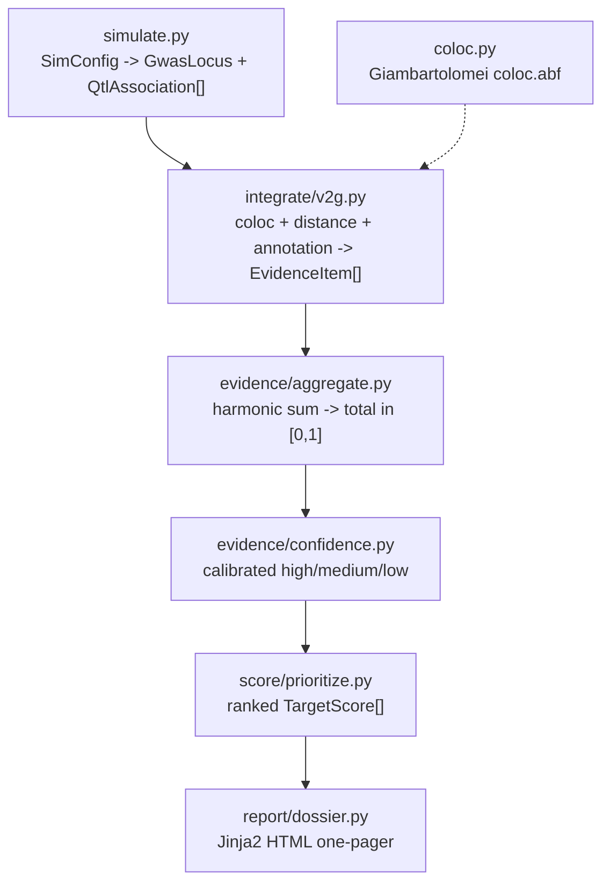

# Architecture

The package is a linear, typed pipeline. Each stage consumes and emits the
pydantic models in `models.py`, so stages are independently testable and the
data contract is explicit.

## Modules

| Module | Responsibility |
| --- | --- |
| `models.py` | Pydantic evidence-chain models: `Variant`, `Gene`, `QtlAssociation`, `GwasLocus`, `Provenance`, `EvidenceItem`, `TargetScore`. |
| `simulate.py` | Deterministic known-answer simulator (`SimConfig`). |
| `coloc.py` | Giambartolomei-2014 `coloc.abf` (per-SNP ABF, PP.H0..H4). |
| `integrate/v2g.py` | Colocalization-based V2G + distance + annotation; emits provenance-stamped evidence. |
| `evidence/aggregate.py` | Open-Targets weighted harmonic-sum aggregation. |
| `evidence/confidence.py` | Calibrated confidence labels. |
| `score/prioritize.py` | Locus-level ranking into ordered `TargetScore`s. |
| `report/dossier.py` | Jinja2 HTML dossier rendering. |
| `cli.py` | Typer CLI: `simulate`, `integrate`, `score`, `report`, `run-all`. |

## Design principles

- **Typed contract everywhere.** Pydantic models validate at every boundary.
- **Provenance is mandatory.** Every `EvidenceItem` carries dataset/method/timestamp (ADR-0003).
- **Deterministic.** All randomness flows from a single seeded RNG.
- **No magic numbers.** Thresholds (coloc priors, decay length, confidence cutoffs) are named module constants with rationale in their docstrings and the ADRs.
- **Real science, no stubs.** `coloc.abf` and the harmonic sum are correct implementations, validated by known-answer tests.
